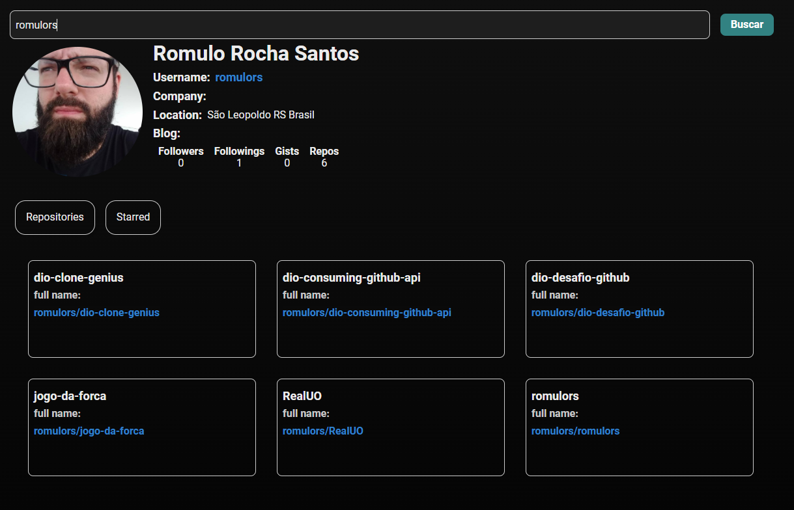

# Consumindo a API do Github com React - Projeto Bootcamp DIO - Eduzz

Busca dados de algum usuário do Github através de seu nome de usuário.

## About project

Projeto em React baseado em uma série de vídeos de [Matheus Benites](https://github.com/benits), com código original disponível em seu [repositório](https://github.com/benits/github-api-interface).

Os principais aspectos abordados foram o consumo de uma API externa e a separação dos componentes React.

## Tela do Projeto

### Principais Bibliotecas utilizadas

- [axios](https://www.npmjs.com/package/axios)
- [react-tabs](https://www.npmjs.com/package/react-tabs)
- [styled-components](https://styled-components.com/)